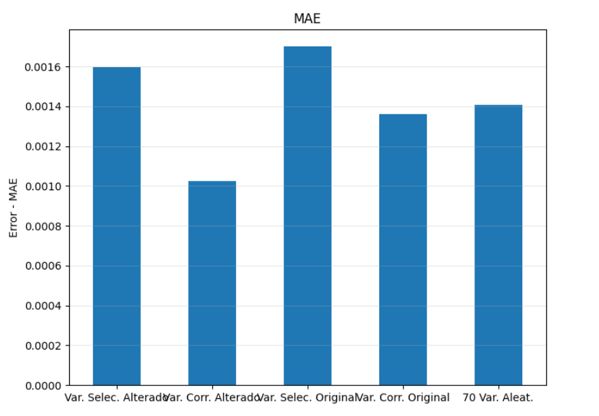
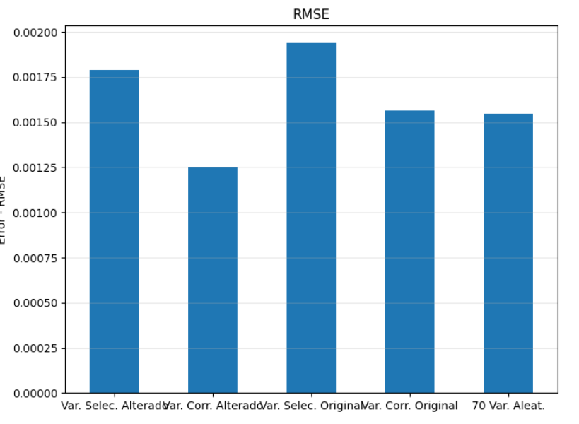
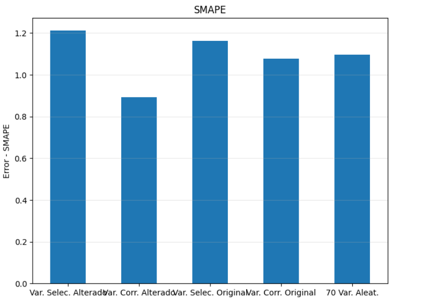
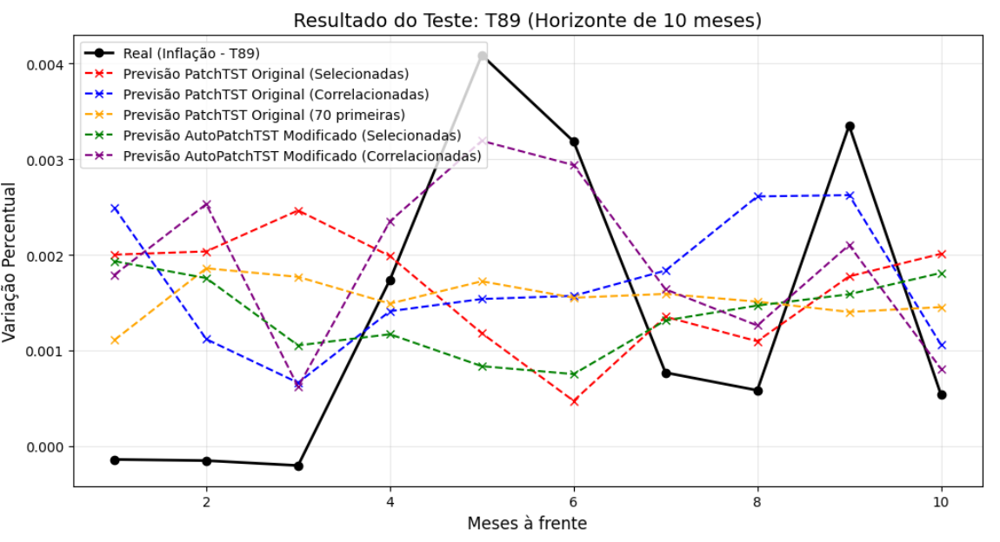

# meissa-final-project
A time series forecasting project developed for a MEISSA Project (LIAD/UFCG) training that analyzes the performance of the PatchTST model in forecasting of different sets of some of 107 macroeconomic variables from the FRED-MD dataset, using different training approaches.

**DESCRIPTION**

This project represents the final stage of the MEISSA project (LIAD/UFCG) training, focusing on predicting one of the variables (T89) from the FRED-MD dataset (which contains multiple macroeconomic variables) using the IBM PatchTST model. The goal is to evaluate how different training set configurations impact the model’s predictive performance. To do this, three different training scenarios were explored. In the first case, the model was trained using a small subset of selected variables (T83, T87, T62, T21, T68), chosen to represent a randomly selected set of variables. In the second case, the model used variables (T93, T96, T97, T98, T99) that showed the highest correlation with the target variable (T89), aiming to leverage stronger statistical relationships. Finally, in the third case, the model was trained using the first 70 variables of the dataset, representing a broader but also randomly selected set of variables. 

Each dataframe was used to train both the original PatchTST model and an alternative version with slightly modified hyperparameters. By comparing these approaches, the project analyzes how both the choice of training data and model parameterization affect forecasting performance.

Below are graphs showing the results of each training scenario, compared using different metrics (MAE, RMSE, SMAPE).

Below is a graph comparing the performance of each scenario (the modified model trained with the first two dataframes and the original model trained with all dataframes).

**HOW TO RUN**

1. Click on "Open In Colab"
2. Run all cells

**AUTHORS**

Anne Grazieli Marques Silva, Luiz Anselmo Medeiros Lima and Pedro Henrique Coelho Torres (Computer Science students at UFCG)
